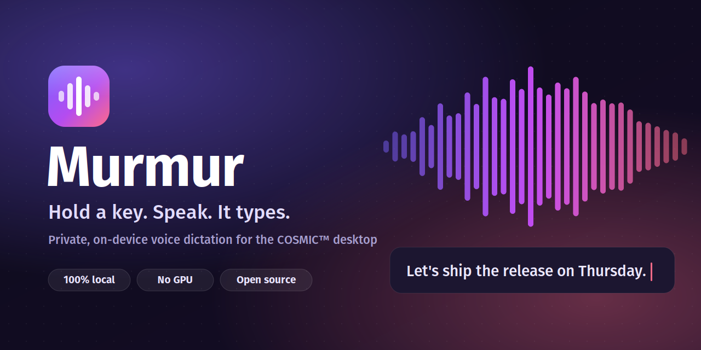
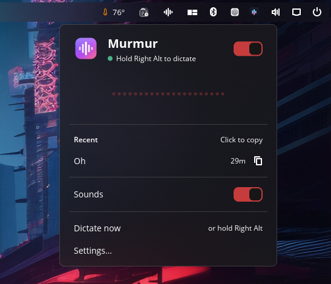
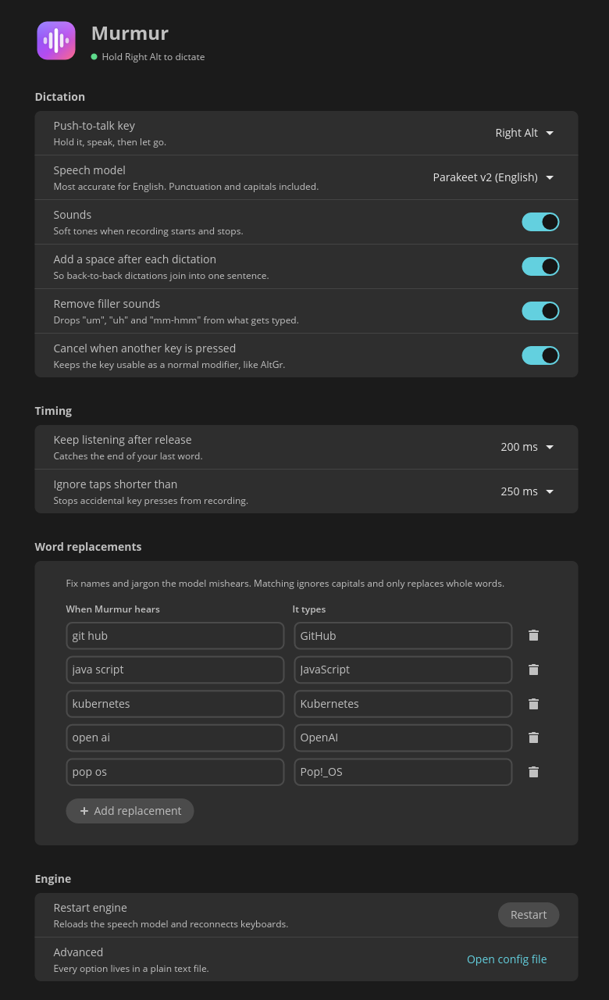

<div align="center">



[](https://github.com/markmiddo/murmur/actions/workflows/ci.yml)
[](https://github.com/markmiddo/murmur/releases/latest)
[](LICENSE)


</div>

---

Murmur is voice dictation for the COSMIC™ desktop. It lives in your panel. Hold **Right Alt**, say what you want to
write, and let go. A moment later the text appears in whatever window you're
using (terminal, browser, editor, chat), with punctuation and capitals.

Speech recognition runs entirely on your machine using NVIDIA's
[Parakeet](https://huggingface.co/nvidia/parakeet-tdt-0.6b-v2) model. Nothing
you say is sent anywhere. There's no account, no subscription and no GPU
required: a few seconds of speech is transcribed in 100–400 ms on a desktop CPU.

<table>
  <tr>
    <td width="50%" align="center"><br><sub>The panel applet</sub></td>
    <td width="50%" align="center"><br><sub>Settings</sub></td>
  </tr>
</table>

## Features

- **Push-to-talk** on Right Alt, or any key you choose. Press another key while
  holding it and the recording cancels, so Right Alt still works as AltGr.
- **Types into any app** through the Wayland virtual keyboard, falling back to
  the clipboard if a window won't accept typing.
- **Panel applet** that turns into a live level meter while you speak, with
  your recent dictations one click from the clipboard.
- **Settings window** for the key, model, sounds, timing and word replacements.
  Changes apply instantly.
- **Word replacements** for names and jargon the model mishears
  ("java script" → "JavaScript").
- **English or 25 languages.** Parakeet v2 for the best English accuracy, v3
  for multilingual with automatic language detection.

## Built to keep working

Dictation tools tend to break quietly. Murmur is designed not to:

- **Keyboards come and go.** Every keyboard is watched, and the list is
  rescanned every two seconds. A Bluetooth keyboard that sleeps or re-pairs
  comes straight back, and unplugging one mid-dictation never stops the listener.
- **Microphones come and go.** The mic is opened fresh for each dictation, so
  switching to a headset just works.
- **Crashes recover on their own.** The speech engine (`murmurd`) runs
  separately from the panel applet. If it crashes, systemd restarts it within
  two seconds and the applet reconnects. If systemd isn't managing it, the
  applet starts it.
- **No silent failures.** A watchdog exits the engine if the keyboard listener
  ever stalls, so it can never be running but deaf. Problems show in the panel
  icon instead.

## Requirements

- The [COSMIC™ desktop](https://system76.com/cosmic) on Wayland, with PipeWire
- `wtype` and `wl-clipboard` (bundled in the Flatpak)
- Your user in the `input` group, so Murmur can see the push-to-talk key:
  ```sh
  sudo usermod -aG input $USER   # then log out and back in
  ```
- About 700 MB of disk for the speech model, downloaded on first run

## Install

### Download a release

Grab the latest `murmur-*-x86_64-linux.tar.gz` from
[Releases](https://github.com/markmiddo/murmur/releases), then:

```sh
tar xzf murmur-*-x86_64-linux.tar.gz
cd murmur-*-x86_64-linux
./install.sh
```

It installs to `~/.local` for your user and starts the engine. Remove it any
time with `./uninstall.sh`.

### Flatpak

A Flatpak manifest lives in [`flatpak/`](flatpak/). To build and install it
locally:

```sh
just flatpak
```

### From source

To build from source you need
[Rust](https://rustup.rs) and [`just`](https://github.com/casey/just).

```sh
# Debian / Ubuntu / Pop!_OS build dependencies
sudo apt install just wtype wl-clipboard pipewire-bin pkg-config libxkbcommon-dev libwayland-dev

git clone https://github.com/markmiddo/murmur
cd murmur
just install
```

`just install` installs to `~/.local` for your user only; no root needed. It
also enables the `murmurd` user service and restarts the panel.

Then add **Murmur** to your panel: **COSMIC Settings → Desktop → Panel →
Configure panel applets → Add applet**. On first run it downloads the speech
model (the panel shows progress). When the status says *Hold Right Alt to
dictate*, you're ready.

To remove it:

```sh
just uninstall
```

## Using it

| Do this | To |
| --- | --- |
| Hold **Right Alt**, speak, let go | Dictate into the focused window |
| Press another key while holding | Cancel (Right Alt acts as AltGr) |
| Click the panel icon | Open the popup: status, recent dictations, settings |
| Click a recent dictation | Copy it to the clipboard |
| Click the panel icon while recording | Stop recording |
| **Dictate now** in the popup | Record without the hotkey; click the icon to stop |

## Configuration

Everything is editable in the Settings window: open **Murmur** from the app
launcher, or **Settings…** in the popup. It's stored as plain TOML in
`~/.config/murmur/config.toml`:

```toml
hotkey = "KEY_RIGHTALT"          # any Linux key name, e.g. KEY_F13
model = "parakeet-tdt-0.6b-v2"   # or parakeet-tdt-0.6b-v3 for multilingual
sounds = true
trailing_space = true            # join back-to-back dictations
cancel_on_other_key = true
release_tail_ms = 200            # keep listening briefly after release
min_hold_ms = 250                # ignore accidental taps

[replacements]
"java script" = "JavaScript"
"open ai" = "OpenAI"
```

After editing the file by hand, run `systemctl --user restart murmurd`.

## How it works

```
 keyboard ──evdev──▶ murmurd ◀──PipeWire (pw-record)── microphone
                       │
                       ├─ Parakeet TDT 0.6B (ONNX Runtime, int8, CPU)
                       ├─ word replacements
                       └─ wtype ──Wayland virtual keyboard──▶ focused window
                       ▲
                 D-Bus │ io.github.markmiddo.Murmur1
                       ▼
               murmur-applet (panel)   murmur-settings (window)
```

The workspace has three crates:

| Crate | Binary | Role |
| --- | --- | --- |
| `daemon` | `murmurd` | Hotkey listener, audio capture, speech engine, typing, D-Bus service |
| `applet` | `murmur-applet`, `murmur-settings` | libcosmic panel applet and settings window |
| `common` | | Shared config, model catalogue and D-Bus names |

## Troubleshooting

**Nothing happens when I hold Right Alt.** Check the panel icon. A "!" means
something is wrong; open the popup to see what. The most common cause is not
being in the `input` group.

**It types in the wrong place or not at all.** Murmur types into the focused
window. If an app won't accept virtual keyboard input, the text is copied to
the clipboard instead and you'll get a notification.

**A word keeps coming out wrong.** Add it under *Word replacements* in Settings.

Logs:

```sh
journalctl --user -u murmurd -f     # engine
cat ~/.cache/murmur/applet.log      # panel applet
murmurd --transcribe clip.wav       # test the model on a recording
```

## Privacy

Murmur has no telemetry and makes exactly one kind of network request: it
downloads the speech model from Hugging Face the first time you use it. Audio
is recorded only while you hold the key, stays in memory, and is discarded
once it's transcribed. Your recent dictations are kept in memory for the
popup and are gone when the engine restarts.

## Development

```sh
just build        # release build of everything
just test         # unit tests
just install      # install and restart the running copy
```

See [CONTRIBUTING.md](CONTRIBUTING.md) for how to send changes.

## Credits

- [NVIDIA Parakeet](https://huggingface.co/nvidia/parakeet-tdt-0.6b-v2) speech
  models (CC-BY-4.0), via the ONNX exports by
  [istupakov](https://huggingface.co/istupakov)
- [parakeet-rs](https://github.com/altunenes/parakeet-rs) and
  [ONNX Runtime](https://onnxruntime.ai)
- [libcosmic](https://github.com/pop-os/libcosmic) by System76
- [wtype](https://github.com/atx/wtype)

## License

COSMIC is a trademark of System76, Inc. Murmur is an independent
project and is not affiliated with or endorsed by System76.


[MIT](LICENSE). The speech models are © NVIDIA and licensed under
[CC-BY-4.0](https://creativecommons.org/licenses/by/4.0/); Murmur downloads
them from Hugging Face on first run and doesn't redistribute them.
